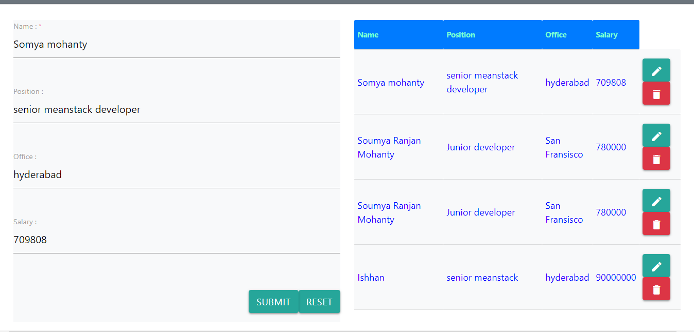

# MEAN Stack CRUD Operations for Beginners
> This is a MEAN Stack Demo Project Showing `CRUD Operations` `Insert` `Update` `Delete` and `Read`.
# Screenshot of the Web Interface

# Screenshot of the Terminal

# How to start Project
> 1.Start `@angular/cli`
```
ng serve --open
```
> 2.Start `node.js server`
```
nodemon `index.js` / node `index.js`
```
> 2.Start `mongo server`
```
mongod
```

